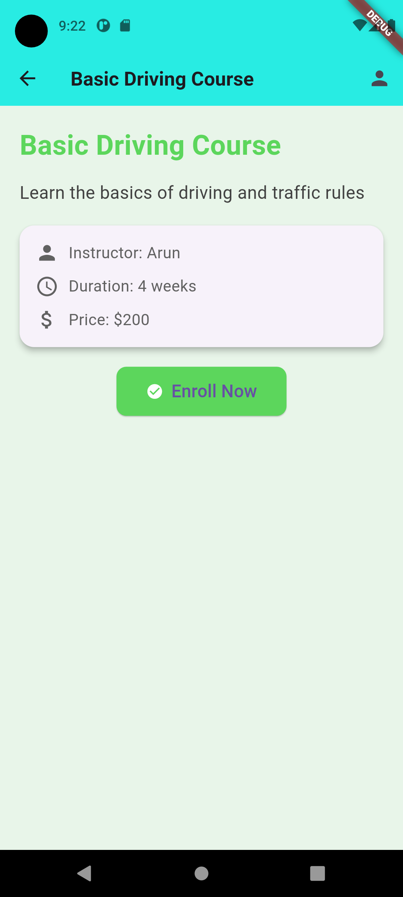
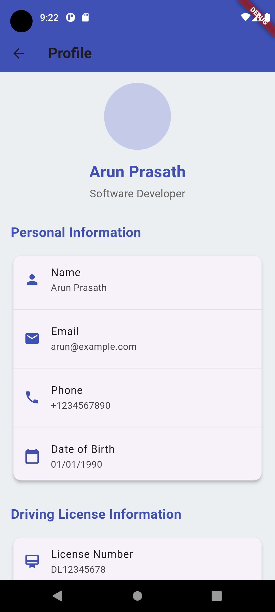

# Flutter Driving Course App

A Flutter application that showcases course details and a user profile page.

## Features
- Display course details with enroll functionality.
- Profile page with personal and driving license information.
- Modern UI with improved design.

## Screenshots
### Home Page
![Home Page]
<!-- Adjust the width to 500px -->


### Login Page

<!-- Adjust the width to 500px -->


### Course Page

<!-- Adjust the width to 500px -->


### Course Details Page

<!-- Adjust the width to 500px -->


### Profile Page

<!-- Adjust the width to 500px -->


## How to Run
1. Clone the repository:
   ```bash
   git clone https://github.com/arunprasathd005/driving_school_online.git
